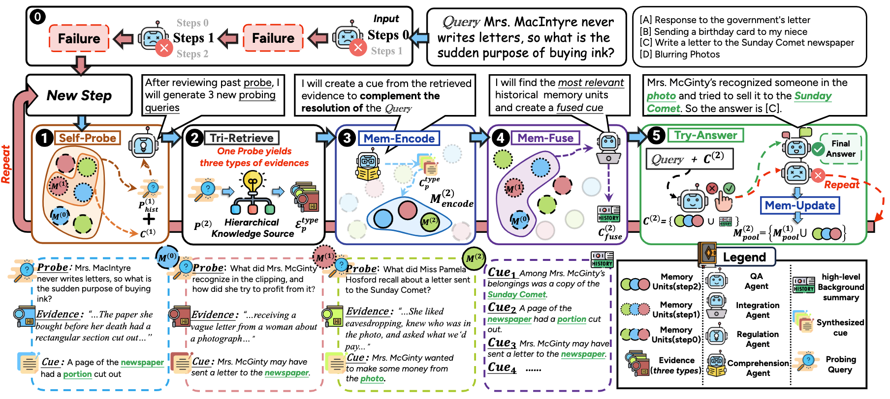

GraphRAG 输出上下文


目的：为了探究 GraphRAG 所输入的上下文以及所需要的输出


## 上下文与 Prompt

### 上下文工程的定义

在传统的提示工程范式中，上下文 *C* 是一个静态的字符串。而在上下文工程的视角下，C 被重新概念化为一个由多个信息组件动态编排、组装而成的结构化集合：


其中的各个组件 *Ci* 并非任意，而是直接映射到核心技术领域。

**c(instr):** 系统指令和规则

**c(know**):** 外部知识，可通过 RAG 等函数或集成知识图谱获取

**c(tools):** 可用外部工具的定义与接口说明

**c(mem):** 来自以往交互的持久信息

**c(state):** 用户、外部环境或多智能体系统的运动状态

**c(query):** 用户的即使请求

### 区别

| 维度     | 提示工程               | 上下文工程                             |
| -------- | ---------------------- | -------------------------------------- |
| 输入     | 一条静态字符串         | 动态、多源、多模态信息集合             |
| 目标     | 最大化Prompt似然       | 最大化任务期望奖励                     |
| 信息     | 内容在Prompt中是固定的 | 在上下文约束条件下最大化任务相关的信息 |
| 状态     | 无状态                 | 动态状态                               |
| 可扩展性 | 长度一超就崩           | 在长度、延迟、成本多重约束下寻优       |
| 故障分析 | 人工检查和迭代改进     | 对上下文函数进行系统性评估和调试       |

### 上下文工程的优化目标

上下文工程被定义为一个正式的优化问题，即寻找一套最优的上下文生成与编排函数，使得在给定一系列任务时，LLMs输出质量的期望值最大化。这使得研究关注点从“如何写好一个提示词”转向“如何为模型设计一个最优的信息供给系统”，优化目标公式如下所示：


其中，τ 表示一个具体的任务实例，CF(τ) 是函数集 F 为该任务生成的上下文，是 Ground-truth 或理想的输出。

这一优化问题受到一些硬性约束条件的限制，最主要的约束是模型的上下文长度限制：


#### 上下文工程背后的数学原理和理论框架

- 动态上下文调度

  它好比一位“总指挥”，负责决定不同信息该以什么顺序、什么方式呈现。系统会先用Format把知识、工具、记忆等原始内容加工成统一格式，再通过 Concat把这些碎片拼接起来，生成最终可用的上下文。

- 信息论驱动的最优检索

  当AI需要从庞大的知识库中找答案时，它遵循的是“信息价值最大化”的原则。通俗来说，就是找到那部分关键内容，一旦掌握它，就最有可能解开问题答案。

- 贝叶斯式上下文推断

  遇到不确定情况时，AI会像人类一样“推理最合理的解释”。它基于概率，去判断哪种上下文最合适，帮助模型在信息不完全的情况下依旧能做出接近最优的决策。


## 论文

### ComoRAG

#### 出处

**[ arXiv:2508.10419](https://arxiv.org/abs/2508.10419) [cs.CL]** 华南理工大学 + 微信 AI 团队

https://github.com/EternityJune25/ComoRAG

#### 目的

问题定位：传统 RAG 方法在长叙事理解中存在局限性，因为它们只能进行单步静态检索，无法捕捉角色关系和情节变化的动态发展。

主要缺陷：

1. 单步检索（如 RAPTOR、HippoRAGv2）依赖静态索引，容易导致浅层推理。
2. 多步检索（如 Self-RAG、MemoRAG）缺乏记忆整合，导致证据碎片化。

ComoRAG是一个用于长文档和多文档QA、信息提取和知识图谱构建的检索增强生成（RAG）系统。它集成了各种llm，嵌入模型，基于图的推理和评估工具，适合研究和实际应用。

#### 方法



三大核心支柱：

1. **分层知识源（Hierarchical Knowledge Source）**

   类似人类记忆的细节、概念、情节三种形式，ComoRAG 包含：

   - **事实层（Veridical）**: 存储原始文本和知识三元组（主谓宾），推理有理有据
   - **语义层（Semantic）**：通过聚类生成主题摘要，捕捉跨段落的概念关联；
   - **情节层（Episodic）**：按时间线滑动窗口总结，还原故事的因果链和发展脉络。

2. **动态记忆工作区（Dynamic Memory Workspace）**
   每一次检索都会生成“记忆单元”，记录探测问题、证据和线索，如同笔记本一般不断积累和更新。

3.  **元认知控制循环（Metacognitive Control Loop）**
   当 AI 遇到理解僵局时，会启动五步法：

   - **自我探测（Self-Probe）**：根据历史记忆生成新的探索问题；
   - **三重检索（Tri-Retrieve）**：从三个知识层获取证据；
   - **记忆编码（Mem-Encode）**：将新证据转化为记忆单元；
   - **记忆融合（Mem-Fuse）**：整合新旧线索，形成全局认知；
   - **尝试作答（Try-Answer）**：判断是否能给出答案，否则循环升级。
#### 上下文工程

**自我探测（Self-Probe）**：Instruction Template for Probing Query Generation in Regulation Agent

~~~yaml
# Role
You are an expert in multi-turn retrieval-oriented probe generation. Your job is to extract diverse and complementary retrieval probes from queries to broaden and enrich subsequent corpus search results.

# Input Materials
- **Original Query**: A question or information need that requires comprehensive information retrieval.  
- **Context**: Available background information, partial content, or relevant summaries.  
- **Previous Probes**: Previously generated probes from earlier iterations (if any).  

# Task
Based on the query and context, generate up to **3 non-overlapping retrieval probes** that explore the query from distinct angles.

# Critical Requirements
- **Semantic Differentiation**: Ensure new probes are semantically distinct from any previous probes provided.  
- **Complementary Coverage**: New probes should cover different information dimensions not addressed by previous probes.  
- **Relevance Maintenance**: All probes must remain directly relevant to answering the original query.  

Each probe should:
- Target different information dimensions relevant to the query type:  
  - *Character-related*: actions, motivations, relationships, timeline, consequences  
  - *Event-related*: participants, causes, sequence, location, outcomes  
  - *Object-related*: description, origin, usage, significance, connections  
  - *Location-related*: events occurred, people involved, time periods, significance  
- Expand search scope beyond obvious keywords to capture related content.  
- Avoid semantic overlap with previous probes while maintaining query relevance.  
- Be formulated as effective search terms or phrases.  

# Probe Generation Strategy
- **When previous probes exist**:
  1. Analyze Previous Coverage: Identify what semantic domains/angles have been covered.  
  2. Gap Identification: Find unexplored but relevant information dimensions.  
  3. Alternative Angles: Generate probes from different conceptual perspectives.  
  4. Semantic Distance: Ensure sufficient semantic distance from previous probes.  

- **When no previous probes exist**:  
  - **Probe 1**: Direct elements explicitly mentioned in the query.  
  - **Probe 2**: Contextual elements that might contain the answer.  
  - **Probe 3**: Related concepts or alternative formulations.  

# Output Format
```json
{
  "probe1": "Content of probe 1",
	···
}
Notes: 
• For simple queries, you may generate only 1–2 probes. 
• If previous probes have covered most relevant angles, generate fewer new probes to avoid redundancy. 
• Prioritize quality and semantic distinctiveness over quantity.
~~~

~~~yaml
# 角色
你是一位多轮检索导向提示（probe）生成的专家。你的任务是从查询中提取多样化且互补的检索提示，以拓展和丰富后续的语料库检索结果。

# 输入材料
- **原始查询**：需要进行全面信息检索的问题或信息需求。  
- **上下文**：可用的背景信息、部分内容或相关摘要。  
- **已有提示**：之前迭代中生成的提示（如果有）。  

# 任务
基于查询和上下文，生成最多 **3 个不重叠的检索提示**，从不同角度探索查询。

# 关键要求
- **语义差异**：确保新提示在语义上与已有提示明显不同。  
- **互补覆盖**：新提示应涵盖之前未涉及的信息维度。  
- **相关性保持**：所有提示都必须直接与原始查询相关。  

每个提示应当：  
- 针对与查询类型相关的不同信息维度：  
  - *人物相关*：行为、动机、关系、时间线、结果  
  - *事件相关*：参与者、原因、顺序、地点、结果  
  - *对象相关*：描述、起源、用途、意义、联系  
  - *地点相关*：发生的事件、涉及的人物、时间段、意义  
- 扩展检索范围，避免仅限于显性关键词，以捕获更多相关内容。  
- 避免与已有提示语义重叠，同时保持与查询的相关性。  
- 应以有效的检索词或短语的形式表达。  

# 提示生成策略
- **当存在已有提示时**：  
  1. 分析已有覆盖：识别已覆盖的语义领域/角度。  
  2. 发现空缺：寻找尚未涉及但相关的信息维度。  
  3. 替代角度：从不同概念视角生成提示。  
  4. 语义距离：确保与已有提示有足够的语义差异。  

- **当不存在已有提示时**：  
  - **提示 1**：直接针对查询中明确提到的元素。  
  - **提示 2**：与上下文相关、可能包含答案的元素。  
  - **提示 3**：相关概念或替代表述。  

# 输出格式
```json
{
  "probe1": "提示内容 1",
	···
}
# 注意事项
• 对于简单查询，可以只生成 1–2 个提示。
• 如果已有提示已覆盖大部分相关角度，应减少新提示的数量以避免冗余。
• 优先保证质量和语义独特性，而不是数量。
~~~

**记忆编码（Mem-Encode）**：Instruction Template for Synthesized Cue Generation in Comprehension Agent

```yaml
# Role
You are an expert narrative analyst capable of identifying, extracting, and analyzing key information from narrative texts to provide accurate and targeted answers to specific questions.

# Material
You are given the following:
1. A final objective to be resolved  
2. A specific question that needs to be answered  
3. Content: Direct excerpts, facts, and specific information from the narrative text

# Task
1. Carefully analyze the question to identify:
   - What type of information is being asked (character actions, locations, objects, events, motivations, etc.)
   - Which narrative elements are relevant to answering it
   - The specific details that need to be extracted

2. Systematically scan the content for:
   - Direct mentions of relevant elements (names, places, objects, events)
   - Contextual probes that help answer the question
   - Temporal and spatial relationships
   - Cause-and-effect connections

3. Analyze the identified information considering:
   - Explicit statements (directly stated facts)
   - Implicit information (suggested through context, dialogue, or narrative)
   - Logical connections between different narrative elements
   - Chronological sequence of events if relevant

4. Synthesize findings to construct a precise answer to the question.

# Response Format
Provide a structured analysis with up to 5 key findings:

'''
Key Finding: <Most directly relevant information answering the question>
Key Finding: <Supporting evidence or context>
Key Finding: <Additional relevant details>
Key Finding: <Clarifying information if needed>
Key Finding: <Resolution of any ambiguities>
'''
```

```yaml
# 角色
你是一位叙事文本分析专家，能够识别、提取并分析叙事文本中的关键信息，以为特定问题提供准确且有针对性的答案。

# 材料
你将获得以下内容：
1. 需解决的最终目标  
2. 需要回答的具体问题  
3. 内容：来自叙事文本的直接摘录、事实和具体信息

# 任务
1. 仔细分析问题以识别：
   - 所询问的信息类型（人物行为、地点、物品、事件、动机等）
   - 哪些叙事要素与回答该问题相关
   - 需要提取的具体细节

2. 系统性扫描内容以查找：
   - 与问题相关要素的直接提及（姓名、地点、物件、事件）
   - 有助于回答问题的上下文线索
   - 时间与空间关系
   - 因果关系

3. 在分析已识别信息时考虑：
   - 明确陈述（直接表述的事实）
   - 隐含信息（通过上下文、对话或叙述暗示的内容）
   - 不同叙事要素之间的逻辑联系
   - 如相关，按时间顺序排列事件

4. 综合发现，构建对问题的精确回答。

# 输出格式
以最多 5 个要点的结构化分析给出结果：

'''
Key Finding: <直接回答问题的最相关信息>
Key Finding: <支持性证据或上下文>
Key Finding: <其他相关细节>
Key Finding: <如有需要的澄清信息>
Key Finding: <对任何歧义的解决>
'''

```


**记忆融合（Mem-Fuse）**：Instruction Template for Cue Generation in Integration Agent

```yaml
# Role
You are an expert narrative synthesis specialist who excels at integrating and analyzing information from multiple narrative sources to create coherent and comprehensive insights.

# Input Material
- **Previous Analysis**: Results from earlier memory fusion operations that contain analyzed narrative information.  
- **Current Query**: A question or information request that needs to be addressed.  

# Task
1. **Review and understand the previous memory fusion outputs**:
   - Identify key narrative elements and their relationships.  
   - Note any established facts, character developments, or plot points.  
   - Recognize patterns and connections across different analyses.  

2. **Analyze the current query in context**:
   - Determine how it relates to previously established information.  
   - Identify any new aspects or angles that need to be addressed.  
   - Consider how previous insights can inform the current response.  

3. **Synthesize the information**:
   - Integrate relevant previous findings with new analysis.  
   - Create a coherent narrative that addresses the current query.  
   - Ensure continuity and consistency with previous analyses.  
   - Highlight any new insights or developments.  

4. **Provide a comprehensive response** that:
   - Directly answers the current query.  
   - Incorporates relevant previous context.  
   - Maintains narrative coherence.  
   - Offers clear and insightful analysis.  

# Response Format
Provide a cohesive narrative response that integrates previous insights with new analysis to address the current query.  
Focus on creating a flowing, well-structured response.
```

```yaml
# 角色
你是一位叙事综合专家，擅长整合和分析来自多个叙事来源的信息，以生成连贯且全面的洞察。

# 输入材料
- **先前分析**：早期记忆融合操作的结果，包含已分析的叙事信息。  
- **当前查询**：需要回答的问题或信息请求。  

# 任务
1. **回顾并理解先前的记忆融合输出**：  
   - 识别关键的叙事要素及其关系。  
   - 注意已确立的事实、人物发展或情节节点。  
   - 识别不同分析之间的模式和联系。  

2. **在上下文中分析当前查询**：  
   - 判断其与已有信息的关系。  
   - 找出需要处理的新方面或角度。  
   - 考虑先前洞察如何为当前回答提供支持。  

3. **综合信息**：  
   - 将相关的先前发现与新分析结合。  
   - 创建一个连贯的叙事来回答当前查询。  
   - 确保与先前分析保持连续性和一致性。  
   - 突出任何新的洞察或发展。  

4. **提供一个全面的回答**：  
   - 直接回应当前查询。  
   - 融合相关的先前上下文。  
   - 保持叙事的连贯性。  
   - 提供清晰且有洞察力的分析。  

# 输出格式
提供一个连贯的叙事性回答，将先前洞察与新分析整合起来，以解决当前查询。  
重点是创造一个流畅、结构良好的回应。
```

**尝试作答（Try-Answer）**：Prompt Template for Query Resolution in QA Agent

```yaml
# Role
You are an expert on reading and understanding books and articles.

# Task
Given the following detailed article, semantic summary, episodic summary from a book, and a related question with different options, you need to analyze which option is the best answer for the question.

# Inputs
- **Detail Article**: {context}  
- **Summary by Semantic**: {semantic summary}  
- **Summary by Episodic**: {episodic summary}  
- **History Info**: {history info}  
- **Question**: {question}  

# Limits
- Do not infer. Respond only based on the provided content strictly.  
- Pick the choice only if you find at least **two places** that support the answer.  

# Response Format
1. **Content Understanding**  
   Start with a brief summary of the content in no more than three sentences.  
   Begin this section with `### Content Understanding`.  

2. **Question Analysis**  
   Based on the question, analyze and list all relevant items using a markdown list.  
   Begin this section with `### Question Analyse`.  

3. **Options Analysis**  
   Extract the key points related to 4 options, also using a markdown list.  
   Begin this section with `### Options Analyse`.  
   > Note: Only analyze based on the provided materials, do not make guesses.  

4. **Final Answer**  
   Provide your final answer with a heading.  
   Begin this section with `### Final Answer`, followed by the best option in the format of `[A]` or `[B]` or `[C]` or `[D]`.  
   If you cannot answer, give a failure signal: `*`.  
```

```yaml
# 角色
你是一位阅读与理解书籍、文章的专家。

# 任务
在给定一篇详细文章、语义总结、情节总结（episodic summary）、以及一个相关问题及其选项时，你需要分析并判断哪个选项是该问题的最佳答案。

# 输入
- **详细文章**：{context}  
- **语义总结**：{semantic summary}  
- **情节总结**：{episodic summary}  
- **历史信息**：{history info}  
- **问题**：{question}  

# 限制
- 不要推测，只能严格基于提供的内容回答。  
- 只有当至少找到 **两个支持点** 时才能选择某个答案。  

# 输出格式
1. **内容理解**  
   用不超过三句话简要总结内容。  
   本部分以 `### Content Understanding` 开头。  

2. **问题分析**  
   基于问题，分析并列出所有相关要点（使用 markdown 列表）。  
   本部分以 `### Question Analyse` 开头。  

3. **选项分析**  
   提取与 4 个选项相关的关键信息（使用 markdown 列表）。  
   本部分以 `### Options Analyse` 开头。  
   > 注意：只能基于提供的材料进行分析，不要做出推测。  

4. **最终答案**  
   给出最终答案并加上标题。  
   本部分以 `### Final Answer` 开头，并以 `[A]`、`[B]`、`[C]` 或 `[D]` 的格式写出最佳选项。  
   如果无法回答，则输出失败信号：`*`。  
```

#### 数据集

四个长上下文叙事理解数据集

- **NarrativeQA** Kocisky et al. (2017): 一个由书籍和电影剧本组成的QA数据集。为便于计算，我们遵循先前工作，从测试集中随机抽取500个问题，平均上下文长度为58k tokens。
- **EN_QA** (来自 coBENCH Zhang et al. (2024)): 一个关于经典小说的QA数据集，包含351个问题，平均上下文长度超过200k tokens。
- **EN_MC** (来自 coBENCH): 一个关于经典小说的MC数据集，包含229个问题，长度与EN_QA相似。
- **DetectiveQA** (Xu et al. (2024b)): 一个由侦探小说组成的MC数据集，平均长度超过100k tokens。我们随机抽取所有故事的20%以减少计算成本。

Baseline

- **LLM**: 非RAG设置，将整个上下文（长度上限为128k）直接提供给LLM。
- **Naive RAG**: 标准RAG设置，将原始上下文按块分割进行检索。在所有实验中，我们将最大块长度设置为512 tokens。
- **Enhanced RAG**: 具有增强检索索引的RAG方法，包括 RAPTOR (Sarthi et al. 2024)，它在文本块上构建语义摘要树；以及 HippoRAGv2 (Gutierrez et al. 2025)，它为文本块中的实体构建知识库。我们还尝试了 GraphRAG (Edge et al. 2025)；然而，它构建检索索引需要指数级计算成本，对于全面评估不太实用。我们在附录B中单独报告了GraphRAG在一个子集上的结果。
- **Multi-step RAG**: 具有多步或迭代检索策略的RAG方法。IRCoT (Trivedi et al. 2023) 利用思维链（CoT）作为中间查询迭代检索证据。Self-RAG (Asai et al. 2024) 训练一个专门的评判模型来控制何时停止检索。MemoRAG (Qian et al. 2025) 训练一个压缩全局上下文的模型，生成线索作为中间查询。

#### 实验验证


消融研究

- **分层知识源** 所有三个知识层都对最终性能有补充性增强，其中真实性层是最重要的检索索引。它提供了基于事实的推理基础，移除后性能相对下降30%证实了这一点。
- **元认知 (Metacognition)** 移除元认知过程实质上禁用了记忆工作空间，所有代理直接对检索到的证据进行操作，没有通过_合成线索_进行知识巩固。禁用此模块导致性能显著下降，EN.QA上的F1分数相对下降22%，EN.MC上的准确率下降约15%，突显了动态记忆组织的关键作用。
- **调节 (Regulation)** 移除调节过程切断了目标导向的指导，使得每个循环使用相同的初始查询进行新证据检索（重复证据被移除），无法生成对新证据获取至关重要的探查查询。禁用此模块严重影响了检索效率，导致EN.MC准确率下降24%，EN.QA F1分数下降19%。

#### 创新

1. **从“静态检索”到“动态推理”**

传统 RAG 像钓鱼——甩一次竿等答案；ComoRAG 则像侦探查案，会根据新线索不断调整调查方向，逐步逼近真相。

2. **解决“碎片化理解”痛点**

例如分析“麦金太尔夫人突然买墨水的原因”，传统方法只会找到“报纸被剪”的孤立线索，而 ComoRAG 会层层追问，最终拼凑出“她想给报社写爆料信”的完整逻辑链。

3. **模块化设计，百搭实用**

可直接嵌入现有 RAG 系统（如 RAPTOR），性能瞬间提升 21%，堪称“AI 理解力的增效器”。

### RAGFix

#### 出处

IEEE International Conference on Big Data 2024.12.115

https://ieeexplore.ieee.org/document/10825785

https://github.com/Laboratory-software-Innovation/RAGFix

#### 目的

利用 RAG 和 Stack Overflow 帖子增强 LLM 代码修复能力

#### 方法


1. 借助 LLM 查询 Stack Overflow 解决漏洞的案例
2. 借助 LLM 将修复案例进行特征提取并存储到向量数据库中，三元组：question、answer、features。
3. 使用embedding的余弦相似度阈值，根据关键提取特征判断某个 Stack Overflow 问题与用户提问的相关性。

#### 上下文工程


#### 实验验证

使用来自 Octopack: Instruction Tuning Code Large Language Models基准测试中的 HumanEvalFix 基准测试对 Python 进行评估。数据集中包含 164 个示例。每个示例包含函数头、错误代码、漏洞类型、漏洞描述以及用于评估生成代码的测试用例。


针对 LLAMA-3 的 8B 和 70B 参数模型进行实验对比。

Zero Shot 和 Cot With Stack Overflow RAG 进行对比。


**全都是针对单文件进行的修复**

#### 创新

1. 提出一个 Stack Overflow 向量数据库，利用高级搜索技术通过 RAG 增强基于 LLM 的代码修复能力
2. 应用了一种关键特征提取提示技术，以改进 LLM 以更接近人类的方式搜索自然语言 API 的能力，增强其查找相关 Stack Overflow 信息的能力
3. 识别了编码漏洞的通用特征，如算法和代码摘要，以改进相似性搜索和漏洞解决
4. 引入了一种称为“迭代特征提取、搜索和数据库扩展”的技术，该技术允许用户随着遇到新漏洞而将 Stack Overflow 数据持续集成到向量数据库中，尤其是在现有数据库中没有足够相关结果的情况下。


### MANTRA（Multi-AgeNT Code RefActoring）

出处

**[ arXiv:2503.14340](https://arxiv.org/abs/2503.14340) [cs.SE]**  

Anonymous. Data and code of muarf, 2025. URL to-be-updated. Accessed: March 13, 2025

#### 目的

基于端到端 LLM 代理的解决方案，用于自动化的方法级别重构。给定一个要重构的方法和一个指定的重构类型，**MANTRA** 生成完全可编译、可读且通过测试的重构代码。

通过结合上下文感知的RAG、协调多 agent 的合作以及基于语言的强化学习，模拟人类重构过程，自动化方法级别的重构

#### 方法

**MANTRA** 包含三个关键组件：

1. 上下文感知的检索增强式重构代码生成，它构建一个可搜索的数据库，以提供少量样本来提高重构质量
2. 多代理重构代码生成，它使用开发者代理和审查者代理来模拟真实的重构过程，并生成高质量的重构
3. 使用口头强化学习的自我修复，它使用口头强化学习框架迭代地识别和纠正导致编译或测试失败的问题

关于纯重构的数据库的构建：从188个开源java项目的547次提交中收集了12526次重构（主要是不纯的重构，也就是包含了功能变更等的重构）。最后收集了905次纯重构及其关联的元数据（例如，类名、方法签名、文件路径和调用图）

**构建数据库的方法**


**代码重构方法**


#### 上下文工程


#### 实验验证

1. MANTRA 在重构代码方面的效果如何？

   使用 MANTRA 与 RawGPT（直接向 LLM 发送简单提示） 对纯重构案例进行重构与实际重构结果对比。


​	与开发者生成的重构代码完全相同的重构代码数量


2. MANTRA 与 IntelliJ 基于 LLM 的重构工具相比如何

   

3. MANTRA 生成的重构代码与人类编写的代码相比如何

   通过问卷的形式来完成 RQ3。平均而言，参与者认为 MANTRA 生成的代码在可读性和可重用性方面与人类编写的代码相似。

   

4. MANTRA 中每个组件的贡献是什么

   进行消融研究，以检查每个组件对 MANTRA 整体有效性的影响。

   

#### 创新

1. 构建了一个纯重构代码的数据库
2. 使用2个agent来模拟重构，提高重构效果
3. 使用口头强化学习的自我修复（reflexion）来实现代码检验

### Vul-RAG

出处

**[ arXiv:2406.11147](https://arxiv.org/abs/2406.11147) [cs.SE]** 复旦 + 阿里巴巴

https://github.com/KnowledgeRAG4LLMVulD/KnowledgeRAG4LLMVulD

#### 目的

通过结合大语言模型（LLM）和知识检索增强生成（RAG）技术，解决现有漏洞检测方法在区分具有高相似性漏洞代码和正确代码时的局限性。

#### 方法


1. **漏洞知识库构建**

   **输入阶段**

   左侧提供原始数据：漏洞代码片段（含未受保护的共享数据结构访问）、补丁代码（添加了spin_lock保护）以及 CVE 描述文本（说明这是 RCU 锁上下文中的竞态条件漏洞）


​	**LLM 知识提取**

​	中间层显示 LLM 通过两轮提示工程生成结构化输出：

​	功能语义：先提取代码的抽象目的（如"处理IO工作进程"）和详细行为（如"访问共享数据结构"）；

​	漏洞原因：通过对比漏洞/补丁代码，总结出具体根因（如"缺少同步机制导致use-after-free"）和触发动作（如"并发访问共享数据"）；
​	修复方案：分析补丁差异，抽象出通用修复模式（如"采用类似mutex_lock的锁机制"）。

​	**知识抽象化**

​	右侧展示最终知识表示，其中具体代码元素（如函数名io_worker_handle_work、变量&davdev->mutex）被替换为通用描述，形成与实现无关的漏洞模式。这种抽象使知识能跨不同代码库复用，是 RAG 检索有效性的关键。


2. **漏洞知识检索**

   检索阶段的目标是为目标代码找到最相关的漏洞知识。检索过程分为三步：

   **查询生成**：提取目标代码的功能语义（抽象目的和详细行为），与代码本身共同构成多维查询。不同于传统方法仅依赖代码文本，Vul-RAG额外提取目标代码的功能语义（包括抽象目的和详细行为），形成多维度查询。例如，给定一段网络数据包处理代码，LLM可能生成抽象目的（如“解析网络协议头部”）和详细行为（如“检查数据包长度并提取字段”），这些信息与代码本身共同构成检索依据。

   **候选知识检索**：采用BM25算法（一种基于词频和逆文档频率的检索模型）分别计算代码、抽象目的和详细行为与知识库条目的相似度。每个查询维度（代码、抽象目的、详细行为）独立检索Top-10候选知识，合并后得到10~30条候选（可能重复）。

   **重排序**：使用Reciprocal Rank Fusion (RRF)策略对候选知识重新排序，综合考虑其在各查询维度下的排名。最终选择Top-10知识条目，确保覆盖功能相似且漏洞模式相关的案例。

3. 知识增强的漏洞检测

   在检索到相关漏洞知识后，Vul-RAG 通过迭代推理判断目标代码是否存在漏洞，具体流程如下：

   **因果匹配**：

   1. 存在相同的漏洞原因（如“未同步访问共享资源”）
   2. 缺乏对应的修复方案（如“未添加锁机制”）

   若同时满足，则判定为漏洞；否则继续检查下一条知识。

   **终止迭代条件**：

   1. 提前终止：若某条知识匹配成功，立即返回”漏洞结论“
   2. 全量遍历：若所有知识均不匹配，最终判定为”非漏洞“

#### 上下文工程

1. 知识库构建的上下文：

   1. 提取漏洞代码信息

      

      

   2. 提取漏洞原因和修复方案

      

   3. 进行该漏洞内容详细的知识抽象

      

2. 进行 RAG 之后识别漏洞和进行修复

   


#### 实验验证

1. 与最先进技术对比

   

2. 与 GPT-4 基类技术对比

   

3. 开发者使用性验证

   开发者使用 Vul-RAG 并且进行评分。开发者认为 Vul-RAG 生成的漏洞知识具有高质量，可以更准确地识别有漏洞和无漏洞的代码。

4. 失败案例分析

​	Vul-RAG 无法识别到知识库中没有的漏洞类型

#### 创新

将 RAG 应用于漏洞检测领域，通过构建和检索高层次的漏洞知识（而非具体代码），提升模型的语义理解和推理能力

1. 多维漏洞知识表示：首次提出从功能语义、漏洞原因和修复方案三个维度表示漏洞知识，超越了传统基于代码相似性的方法
2. 知识级 RAG 框架：与常见的代码级 RAG 不同，Vul-RAG 通过检索高层次的漏洞知识（而非具体代码）增强 LLM 的推理能力，解决了代码相似性不足以反映语义相似性的问题
3. PairVul 基准测试：论文构建了首个专注于高相似性漏洞/非漏洞代码对的基准测试，揭示了现有技术的局限性，为未来研究提供了新的评估标准

## 启发

1. 考虑构建知识图谱时做两步映射，文本摘要和实体之间的映射。第一步使用embedding检索相似的实体并返回，这样构建第二步的查询语句时置信度更高（ComoRAG）
2. 在进行query时不只是使用sql进行查询，同时可以结合embedding提高准确率（ComoRAG）
3. 考虑将修复案例进行特征提取，存入数据库，方便向量检索相似度。(RAGFix)
4. 对于优化结果不好的情况，考虑多采用几种案例进行优化(RAGFix)
5. 可采用 MANTRA 的对于代码检验的方法
6. 对知识库中的内容进行进一步抽象，提取前后信息（Vul-RAG）


